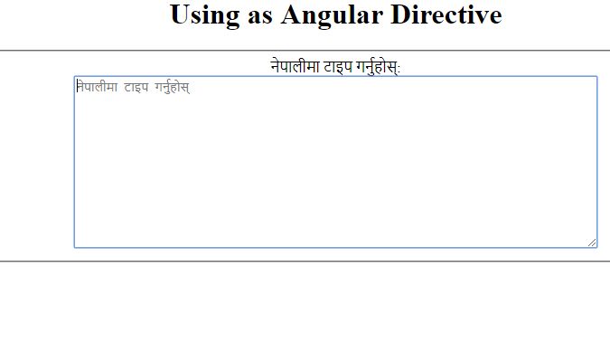

# ngx-nepali-unicode
Angular package that converts Unicode text into Nepali Preeti font.

# Installation
Use Node Package Manager [npm](https://www.npmjs.com) to install ngx-nepali-unicode.
```
npm install ngx-nepali-unicode
```
# Usage
Import `NgxNepaliUnicodeModule` in the root module(`AppModule`):
```typescript
// Import module
import {NgxNepaliUnicodeModule} from 'ngx-nepali-unicode';

@NgModule({
  imports: [
    // ...
    NgxNepaliUnicodeModule.forRoot()
  ]
})
export class AppModule {}
```
You can use `ngx-nepali-unicode` as both Angular `pipe` & `directive`.

1. Using as Angular `directive` in your template
```html
    <fieldset>
      नेपालीमा टाइप गर्नुहोस्:<br/>
      <textarea rows="10" cols="30" nepaliUnicode placeholder="नेपालीमा टाइप गर्नुहोस्"></textarea>
    </fieldset>
```


if you want to bind converted nepali preeti text into your `formControl` value just pass `[formControl]` as Angular `Input`.

Component:
```typescript
//...
import { FormControl } from '@angular/forms';

class AppComponent implements OnInit {
 //FormControl for binding converted Nepali Preeti text 
 public descriptionNep: FormControl = new FormControl();
  constructor() {}
  ngOnInit() {
    
  }
}
```
Template:
```html
     <fieldset>
      Description in Nepali:<br/>
      <textarea rows="10" cols="30" nepaliUnicode [formControl]="descriptionNep" placeholder="नेपालीमा टाइप गर्नुहोस्"></textarea>
    </fieldset>
    <p>You have entered: {{ descriptionNep.value }}</p>
```

2. Using as Angular `pipe` in your template
```html
    <p>{{ 'gfdM' | nepaliUnicode }}:</p> equivalent to
    नामः
```

## Creator

#### [Hikmat Sijapati](mailto:hikmatsijapati2014@gmail.com)

- [@GitHub](https://github.com/hikmat-sijapati)

### License
ngx-nepali-unicode is [MIT licensed](./LICENSE).
